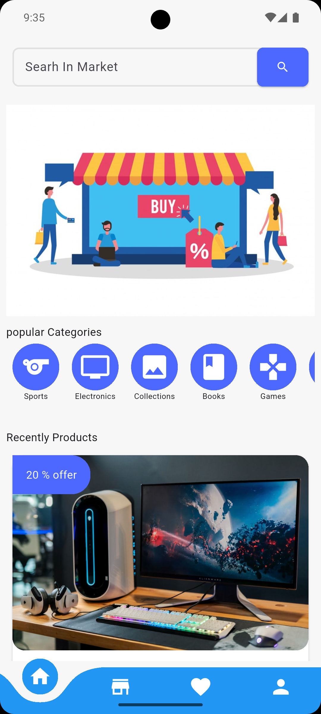
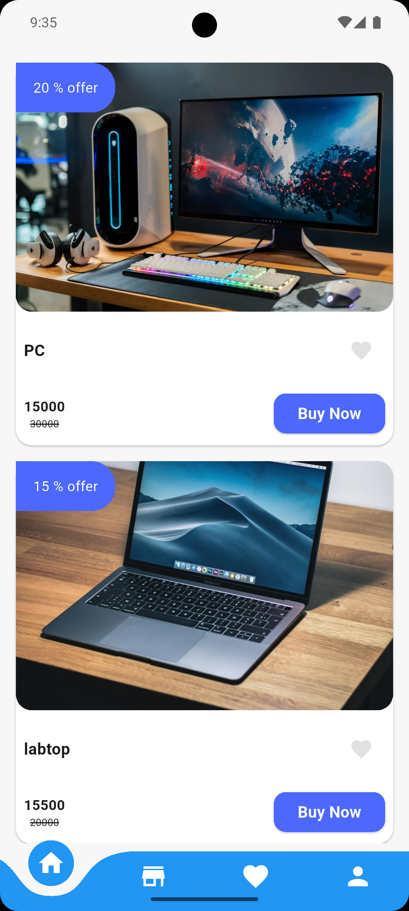
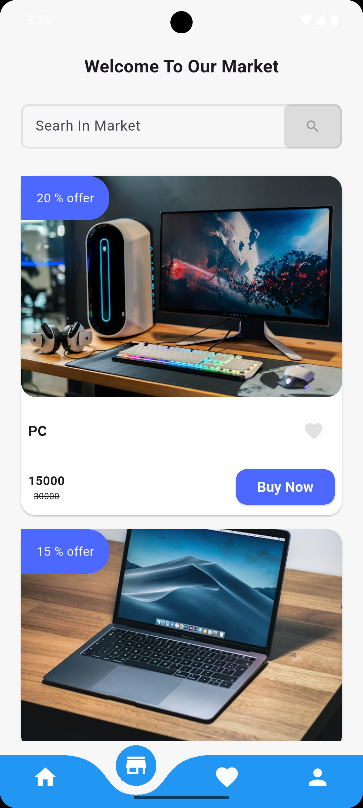
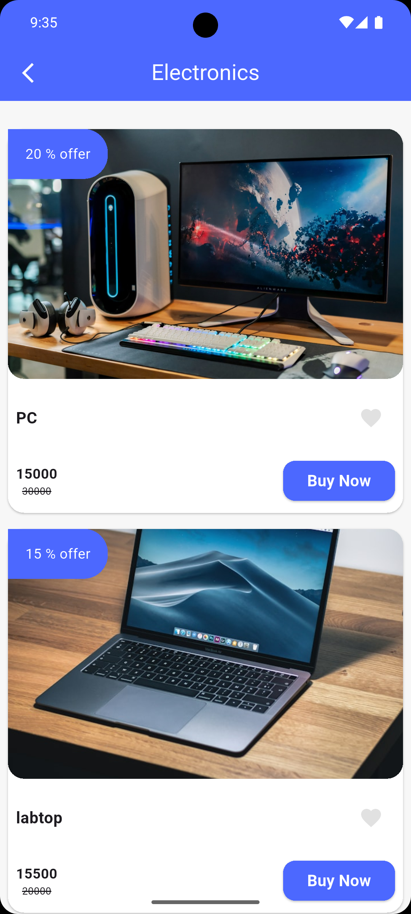
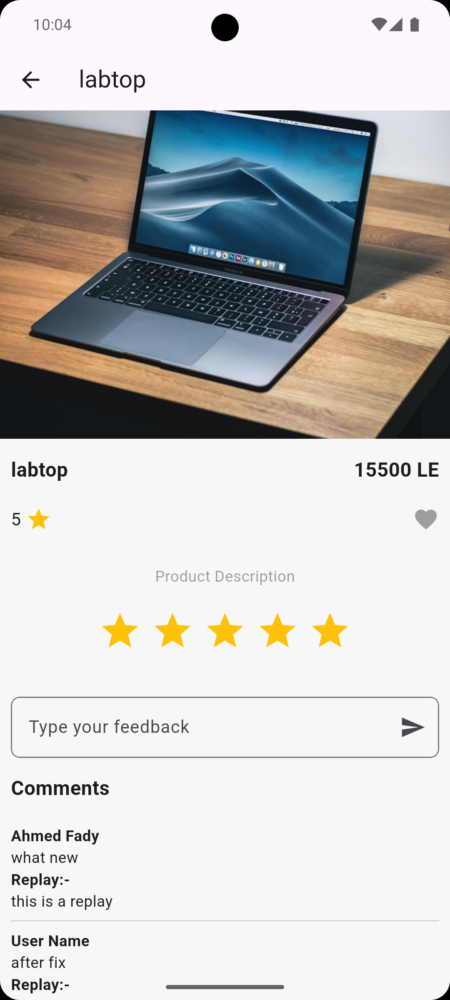
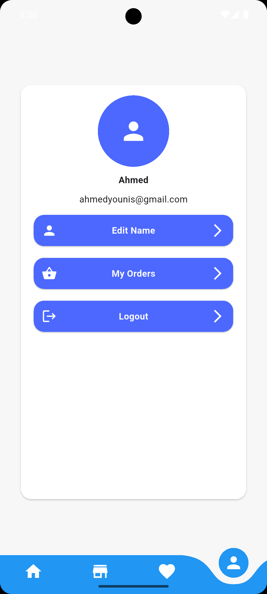

🛒 Our Basket App

A modern e-commerce mobile application built with Flutter, using Supabase as a complete backend solution.

🚀 Overview

Our Basket allows users to browse products, explore categories, manage favorites, and view detailed product information through a smooth and user-friendly shopping experience.

The app is designed with clean architecture principles and real-time backend integration to ensure performance, scalability, and maintainability.

✨ Key Features

🛍 Product browsing with category-based navigation

❤️ Favorites management

🔍 Detailed product pages

👤 User profile management

⚡ Smooth and responsive UI

🧠 Clean architecture for scalable development

🧱 Architecture & Technologies

Framework: Flutter

Architecture: MVVM

State Management: Cubit

Backend: Supabase (Auth, Database, APIs)

  
  

  
  

  
  

  

Database: Supabase PostgreSQL

Tools: Git, GitHub, VS Code
